# 📋 รายละเอียดโค้ดทั้งหมดในโปรเจกต์ UP BUS

โปรเจกต์ **Flutter** สำหรับแอปติดตามรถบัส "UP BUS" ใช้ **Firebase** (Firestore, Realtime Database, Auth) เป็น Backend

## สถาปัตยกรรมโปรเจกต์

```
lib/
├── main.dart                    (68 บรรทัด) - จุดเริ่มต้นแอป
├── login_page.dart              (273 บรรทัด) - หน้าล็อกอิน
├── upbus-page.dart              (1,373 บรรทัด) - หน้าหลัก แผนที่ Live
├── busstop-page.dart            (819 บรรทัด) - หน้าป้ายรถ
├── busstop_map_page.dart        (269 บรรทัด) - แผนที่ป้ายรถ
├── route-page.dart              (253 บรรทัด) - หน้าเส้นทาง
├── plan-page.dart               (1,512 บรรทัด) - หน้าวางแผนเดินทาง
├── feedback-page.dart           (356 บรรทัด) - หน้า Feedback
├── sidemenu.dart                (186 บรรทัด) - เมนูด้านข้าง
├── change_route_page.dart       (624 บรรทัด) - หน้าคนขับเปลี่ยนสาย
├── manager_page.dart            (1,007 บรรทัด) - หน้าผู้จัดการ
├── firebase_options.dart        (99 บรรทัด) - ค่า Firebase config
├── models/
│   ├── bus_model.dart           (111 บรรทัด) - Model รถบัส + สายรถ
│   └── bus_route_data.dart      (297 บรรทัด) - ข้อมูลป้ายและเส้นทาง
├── services/
│   ├── global_location_service.dart  (426 บรรทัด) - ติดตาม GPS + แจ้งเตือน
│   ├── notification_service.dart     (118 บรรทัด) - Push Notification
│   ├── route_planner_service.dart    (641 บรรทัด) - คำนวณเส้นทาง
│   └── route_service.dart            (71 บรรทัด) - OpenRouteService API
└── widgets/
    └── global_debug_bar.dart    (15 บรรทัด) - Debug Wrapper (ปิดแล้ว)
```

---

## 1. `main.dart` (68 บรรทัด)

จุดเริ่มต้นแอป — ตั้งค่า Firebase, Provider, และ Routes

| บรรทัด | ฟังก์ชัน/คลาส | คำอธิบาย |
|--------|--------------|----------|
| 1–21 | **Imports** | นำเข้า Flutter, Firebase, Provider, และทุกหน้าของแอป |
| 22–37 | `main()` | ฟังก์ชันหลัก — `WidgetsFlutterBinding.ensureInitialized()` → `Firebase.initializeApp()` → สร้าง `GlobalLocationService` แล้วห่อด้วย `ChangeNotifierProvider` → `runApp(MyApp())` |
| 39–67 | `MyApp` (StatelessWidget) | กำหนด `MaterialApp` พร้อม Theme สีม่วง, ปิด debug banner |
| 43–66 | `MyApp.build()` | กำหนด **Named Routes** ทั้งหมด: `/` → `UpBusHomePage`, `/busStop` → `BusStopPage`, `/route` → `RoutePage`, `/plan` → `PlanPage`, `/feedback` → `FeedbackPage`, `/login` → `LoginPage`, `/busStopMap` → `BusStopMapPage` |

---

## 2. `login_page.dart` (273 บรรทัด)

หน้าล็อกอิน Firebase Auth — รองรับบทบาท Driver และ Manager

| บรรทัด | ฟังก์ชัน/คลาส | คำอธิบาย |
|--------|--------------|----------|
| 1–4 | **Imports** | `firebase_auth`, `change_route_page`, `manager_page` |
| 6–9 | `LoginPage` (StatefulWidget) | Widget หลักของหน้า login |
| 11–272 | `_LoginPageState` | State หลัก — มีตัวแปร `_emailController`, `_passwordController`, `_isLoading`, `_errorMessage` |
| 23–70 | `_handleLogin()` | ล็อกอินด้วย `FirebaseAuth.instance.signInWithEmailAndPassword()` — ถ้า email ตรงกับรายชื่อ Manager → ไป `ManagerPage`, ถ้าเป็น Driver → ไป `ChangeRoutePage`, อื่นๆ → `pop()` กลับ |
| 73–271 | `build()` | สร้าง UI ล็อกอิน → พื้นหลังสีม่วง Gradient, ช่อง Email/Password, ปุ่ม "เข้าสู่ระบบ", แสดง error message |

---

## 3. `upbus-page.dart` (1,373 บรรทัด) ⭐ ไฟล์หลัก

หน้าแผนที่ LIVE MAP — แสดงตำแหน่งรถแบบ Real-time, ป้ายรถ, เส้นทาง, การแจ้งเตือน

| บรรทัด | ฟังก์ชัน/คลาส | คำอธิบาย |
|--------|--------------|----------|
| 1–20 | **Imports** | `flutter_map`, `latlong2`, `cloud_firestore`, `firebase_database`, `geolocator`, `provider`, `notification_service`, `global_location_service`, `sidemenu`, `flutter_map_animations` |
| 21 | `selectedBusStopId` | ตัวแปร Global เก็บ ID ป้ายที่เลือก |
| 22–27 | `UpBusHomePage` (StatefulWidget) | Widget หน้าหลัก |
| 29–1372 | `_UpBusHomePageState` | State หลัก — ตัวแปรสำคัญ: `_mapController`, `_routePolylines`, `_busMarkers`, `_busStopMarkers`, `_activeFilters`, `_isNotificationsEnabled` ฯลฯ |
| 48–59 | `_getBusColor(String)` | แปลงชื่อสี ("Green"/"Red"/"Blue") → `Color` object |
| 62–73 | `_getBusIconAsset(String)` | แปลงชื่อสี → path ไฟล์ไอคอนรถ |
| 75–86 | `_getRouteNameTh(String)` | แปลงชื่อสี → ชื่อสายภาษาไทย (เช่น "สายหน้ามอ") |
| 89–93 | `initState()` | เรียก `_loadAllRoutes()` และ `_initializeServices()` |
| 100–127 | `_loadAllRoutes()` | โหลดเส้นทางจาก GeoJSON (3 สาย: Green, Red, Blue) + ดึงป้ายรถจาก Firestore + เริ่ม listener ตำแหน่งรถจาก Realtime Database |
| 129–144 | `_parseGeoJson(String, Color)` | อ่านไฟล์ GeoJSON จาก assets → แปลงเป็น `Polyline` |
| 146–170 | `_filterRoutes(int)` | กรองเส้นทาง — index 0=ทุกสาย, 1=Green, 2=Red, 3=Blue, toggle เปิด/ปิดแต่ละสาย |
| 172–176 | `_initializeServices()` | เรียก `GlobalLocationService.initialize()` + `NotificationService.initialize()` |
| 179–181 | `dispose()` | ปิด map controller |
| 186–781 | `build()` | สร้าง UI หลัก → **Stack**: `FlutterMap` (แผนที่), ปุ่มกรองสาย (Green/Red/Blue), Floating Action Buttons (กลับตำแหน่ง/เลือกจุดหมาย/แจ้งเตือน), Proximity Alert Box, TopBar, BottomBar, SideMenu |
| 785–807 | `_routeButton(...)` | สร้างปุ่มกรองสายรถ (วงกลมสี) |
| 809–841 | `_buildTopBar(context)` | AppBar บนสุด — โลโก้ "LIVE MAP", ปุ่ม Hamburger Menu |
| 843–865 | `_floatingMapIcon(...)` | สร้าง Floating Icon บนแผนที่ (GPS, Notification, Destination) |
| 867–945 | `_showDestinationSelectionDialog()` | Dialog เลือกจุดหมายปลายทาง — ดึงป้ายจาก Firestore → `AlertDialog` พร้อม `ListView` |
| 947–952 | `_goToMyLocation()` | ขอพิกัด GPS ผู้ใช้ → เลื่อนแผนที่ไปตำแหน่งปัจจุบัน |
| 954–956 | `_onNotificationIconTap()` | กดปุ่มแจ้งเตือน → เปิด `_showRouteSelectionDialog()` |
| 958–1057 | `_showRouteSelectionDialog()` | Dialog เลือกสายแจ้งเตือน — ทุกสาย/เฉพาะสี + ปุ่มปิดแจ้งเตือน + ปุ่มเลือกจุดหมาย |
| 1059–1086 | `_routeSelectionTile(...)` | สร้าง ListTile สำหรับเลือกสายแจ้งเตือน |
| 1088–1096 | `_showNotificationSnackBar(String)` | แสดง SnackBar ยืนยันเปิดแจ้งเตือน |
| 1098–1297 | `_buildProximityAlertBox(service)` | กล่องแจ้งเตือนรถใกล้ถึง — แสดงชื่อรถ, ระยะทาง, ETA countdown, animation กระพริบ, ปุ่มปิด |
| 1299–1323 | `_buildBottomBar()` | Navigation Bar ด้านล่าง — 5 ไอคอน (Map, BusStop, Route, Plan, Feedback) |
| 1325–1371 | `_bottomNavItem(index, icon, label)` | สร้างแต่ละไอคอนใน Bottom Navigation |

---

## 4. `busstop-page.dart` (819 บรรทัด)

หน้ารายการป้ายรถ — แสดงป้ายแยกตามสาย พร้อมสถานะรถกำลังจอดอยู่

| บรรทัด | ฟังก์ชัน/คลาส | คำอธิบาย |
|--------|--------------|----------|
| 1–5 | **Imports** + `enum BusLine` | นำเข้า Firestore, กำหนด enum `BusLine { yellow, red, blue }` |
| 7–12 | `BusStopPage` (StatefulWidget) | Widget หน้าป้ายรถ |
| 14–818 | `_BusStopPageState` | State หลัก — ตัวแปร: `_selectedLine`, `_busStopDocs`, `_activeBusStops`, `_realtimeSubscription` |
| 51–55 | `dispose()` | ยกเลิก Realtime Database subscription |
| 58–83 | `didChangeDependencies()` | ดึงข้อมูลป้ายรถจาก Firestore + ฟัง Realtime Database สำหรับตำแหน่งรถปัจจุบัน |
| 85–106 | `_handleRouteIdSwitch(routeData)` | ตรวจสอบว่ารถอยู่ที่ป้ายไหน — หาป้ายที่ใกล้ที่สุดจากพิกัด GPS |
| 108–110 | `_onSelectLine(BusLine)` | เปลี่ยนสายที่เลือก (`setState`) |
| 113–473 | `build()` | UI หลัก → TopBar, ปุ่มเลือกสาย (วงกลมสี 3 สี), `StreamBuilder` ฟังข้อมูล Firestore/RTDB → รายการป้ายรถ |
| 477–509 | `_buildTopBar(context)` | AppBar "ป้ายรถ" + ปุ่มดูแผนที่ป้ายรถ |
| 511–553 | `_lineCircle(c, label, sel, tap)` | สร้างปุ่มวงกลมเลือกสาย + animation เมื่อ selected |
| 555–683 | `_buildBusStopCard(...)` | สร้าง Card แต่ละป้าย — ชื่อป้าย, สถานะ (มีรถจอด/ไม่มี), Route Chips, ปุ่มดูบนแผนที่ |
| 686–712 | `_buildBottomBar()` | Bottom Navigation Bar |
| 714–761 | `_bottomNavItem(...)` | แต่ละ Item ใน Bottom Nav |
| 764–817 | `_buildRouteChips(routesData)` | สร้าง Chip แสดงสายที่ผ่านป้ายนี้ (เช่น "สาย Green", "สาย Red") |

---

## 5. `busstop_map_page.dart` (269 บรรทัด)

แผนที่แสดงป้ายรถทั้งหมด — เปิดจากหน้า BusStop

| บรรทัด | ฟังก์ชัน/คลาส | คำอธิบาย |
|--------|--------------|----------|
| 1–4 | **Imports** | `flutter_map`, `latlong2`, `cloud_firestore` |
| 6–11 | `BusStopMapPage` (StatefulWidget) | Widget แผนที่ป้ายรถ |
| 13–268 | `_BusStopMapPageState` | State หลัก — ตัวแปร: `_busStopMarkers`, `_isLoading` |
| 21–27 | `initState()` | เรียก `_fetchBusStops()` |
| 29–53 | `_fetchBusStops()` | ดึงป้ายทั้งหมดจาก Firestore → สร้าง `Marker` ที่แต่ละตำแหน่ง |
| 56–76 | `didChangeDependencies()` | ถ้ามี `selectedStopId` จาก arguments → เลื่อนแผนที่ไปป้ายที่เลือก |
| 80–130 | `_buildRouteChips(routesData)` | สร้าง Chip แสดงสายที่ผ่านป้ายนั้น |
| 133–267 | `build()` | UI แผนที่ → `FlutterMap` พร้อม `TileLayer` (OpenStreetMap) + `MarkerLayer` |

---

## 6. `route-page.dart` (253 บรรทัด)

หน้าแสดงเส้นทาง — แสดงรูปภาพเส้นทาง 3 สาย

| บรรทัด | ฟังก์ชัน/คลาส | คำอธิบาย |
|--------|--------------|----------|
| 1–2 | **Imports** | `flutter/material`, `sidemenu` |
| 4–9 | `RoutePage` (StatefulWidget) | Widget หน้าเส้นทาง |
| 11–252 | `_RoutePageState` | State — ตัวแปร: `_selectedRouteIndex`, `_routeNames`, `_routeColors`, `_routeImages` |
| 34–116 | `build()` | UI → TopBar, ปุ่มกรอง 3 สาย, แสดงรูปภาพเส้นทาง + SideMenu |
| 119–138 | `_routeFilterButton(label, color, index)` | สร้างปุ่มกรองเส้นทาง |
| 142–174 | `_buildTopBar(context)` | AppBar "เส้นทาง" |
| 176–200 | `_buildBottomBar()` | Bottom Navigation |
| 202–251 | `_bottomNavItem(...)` | แต่ละ Item |

---

## 7. `plan-page.dart` (1,512 บรรทัด)

หน้าวางแผนเดินทาง — ค้นหาเส้นทางจากต้นทาง→ปลายทาง, แสดงบนแผนที่

| บรรทัด | ฟังก์ชัน/คลาส | คำอธิบาย |
|--------|--------------|----------|
| 1–10 | **Imports** | `cloud_firestore`, `flutter_map`, `latlong2`, `route_planner_service` |
| 12–17 | `PlanPage` (StatefulWidget) | Widget หน้าวางแผน |
| 19–1511 | `_PlanPageState` | State หลัก — ตัวแปรเยอะ: `_mapController`, `_fromStopId`/`_toStopId`, `_routeResults`, `_routePolylines`, `_routeMarkers`, `_allBusStops`, `_detailedRoutes` |
| 51–54 | `initState()` | เรียก `_loadRouteGeoJson()` และ `_loadDetailedRoutePlan()` |
| 56–80 | `_loadRouteGeoJson()` | โหลด GeoJSON 3 เส้นทาง → เก็บพิกัดทุกจุด สำหรับ draw polyline |
| 82–118 | `_loadDetailedRoutePlan()` | ดึงป้ายรถจาก Firestore → จับคู่กับ internal stop ID ผ่าน `RoutePlannerService.mapFirebaseIdToStopId()` |
| 120–136 | `_parseGeoJsonToPoints(assetPath)` | อ่าน GeoJSON → List ของ `LatLng` |
| 139–158 | `_findMatchingSegmentPoints(from, to)` | หาจุด GeoJSON ที่ตรงกับช่วงป้ายต้นทาง-ปลายทาง |
| 161–291 | `build()` | UI → TopBar, Search Input (from/to dropdown), ปุ่มค้นหา, `FlutterMap`, Route Result Cards, SideMenu |
| 294–354 | `_onSearchBusRoute()` | กดปุ่มค้นหา → เรียก `RoutePlannerService.findAllRoutes()` → `_drawBusRoute()` + `_addRouteMarkers()` |
| 356–430 | `_drawBusRoute(RouteResult)` | วาดเส้นเส้นทางบนแผนที่ — จับคู่ segment กับ GeoJSON coordinates → สร้าง `Polyline` |
| 432–522 | `_addRouteMarkers()` | เพิ่ม Marker บนแผนที่ — ป้ายต้นทาง, ปลายทาง, จุดเปลี่ยนสาย |
| 524–607 | `_createRouteStopMarker(...)` | สร้าง Marker สำหรับแต่ละป้าย (ไอคอน + ชื่อ + สี) |
| 609–632 | `_getStopCoords(stopId)` | ดึงพิกัดจาก internal data หรือ Firestore |
| 634–674 | `_matchesStopId(name, stopId)` | จับคู่ชื่อป้ายกับ ID (fuzzy matching) |
| 676–692 | `_getCoordsFromFirebase(docId)` | ดึงพิกัดจาก Firestore document |
| 695–765 | `_buildRouteResultCards()` | สร้าง Card ทุกตัวเลือก — แนะนำ/ตัวเลือกที่ 2,3... |
| 767–989 | `_buildSingleRouteCard(result, isRec, idx)` | สร้าง Card แต่ละเส้นทาง — แสดงจำนวนป้าย, สายที่ใช้, timeline, time note |
| 991–1093 | `_buildRouteTimeline(result)` | สร้าง Timeline แนวตั้ง — แสดง node ต้นทาง → จุดเปลี่ยน → ปลายทาง |
| 1095–1170 | `_buildTimelineNode(...)` | สร้างแต่ละ Node ใน timeline (วงกลมสี + ชื่อป้าย) |
| 1172–1220 | `_buildTimelineLine(...)` | สร้างเส้นเชื่อมใน timeline (สีของสาย + ชื่อสาย + จำนวนป้าย) |
| 1223–1267 | `_buildDropdown(...)` | สร้าง Dropdown เลือกป้ายต้นทาง/ปลายทาง |
| 1269–1300 | `_buildTopBar()` | AppBar "แพลน" |
| 1302–1374 | `_buildBottomBar()` + `_bottomNavItem()` | Bottom Navigation |
| 1378–1447 | `_buildFullSearchInput()` | ส่วน UI เลือกต้นทาง-ปลายทาง แบบเต็ม (2 dropdown + ปุ่มค้นหา + ปุ่มสลับ) |
| 1449–1510 | `_buildCompactSearchHeader()` | ส่วน UI ย่อ — โชว์ "A → B" กดเพื่อแก้ไข |

---

## 8. `feedback-page.dart` (356 บรรทัด)

หน้าส่ง Feedback — ร้องเรียน + ให้คะแนน

| บรรทัด | ฟังก์ชัน/คลาส | คำอธิบาย |
|--------|--------------|----------|
| 1–5 | **Imports** + `enum FeedbackMode` | `{ complain, rating }` |
| 7–12 | `FeedbackPage` (StatefulWidget) | Widget หน้า Feedback |
| 14–355 | `_FeedbackPageState` | State — ตัวแปร: `_mode`, `_messageController`, `_rating` |
| 25–28 | `dispose()` | ปิด `_messageController` |
| 31–185 | `build()` | UI → TopBar, ปุ่มสลับ Complain/Rating, TextArea ข้อความ, Star Rating (ถ้าเป็น rating mode), ปุ่มส่ง |
| 187–230 | `_onSubmit()` | ส่ง Feedback ไป Firestore collection `'feedback'` — เก็บ type, message, rating, timestamp |
| 232–263 | `_buildTopBar()` | AppBar "Feedback" |
| 265–278 | `_modeButton(label, isSelected, onTap)` | ปุ่มสลับโหมด Complain/Rating |
| 281–354 | `_buildBottomBar()` + `_bottomNavItem()` | Bottom Navigation |

---

## 9. `sidemenu.dart` (186 บรรทัด)

เมนูด้านข้าง (Drawer) — แสดงตามสิทธิ์ผู้ใช้

| บรรทัด | ฟังก์ชัน/คลาส | คำอธิบาย |
|--------|--------------|----------|
| 1–6 | **Imports** | `firebase_auth`, `shared_preferences`, `change_route_page`, `manager_page` |
| 8–13 | `SideMenu` (StatefulWidget) | Widget เมนู |
| 15–185 | `_SideMenuState` | State — กำหนดรายชื่อ `driverEmails` และ `managerEmails` |
| 26–184 | `build()` | สร้าง `Drawer` → Header (โปรไฟล์ + email), เมนูตามบทบาท: ผู้จัดการ → "หน้าผู้จัดการ", คนขับ → "จัดการเดินรถ", ไม่ได้ login → "เข้าสู่ระบบ", ล็อกอินแล้ว → "Logout" (ล้าง SharedPreferences + signOut) |

---

## 10. `change_route_page.dart` (624 บรรทัด)

หน้าคนขับรถ — เลือกเบอร์รถ + เปลี่ยนสาย

| บรรทัด | ฟังก์ชัน/คลาส | คำอธิบาย |
|--------|--------------|----------|
| 1–4 | **Imports** | `firebase_database`, `shared_preferences` |
| 6–11 | `ChangeRoutePage` (StatefulWidget) | Widget หน้าจัดการเดินรถ |
| 13–623 | `_ChangeRoutePageState` | State — ตัวแปร: `_selectedRoute`, `_selectedBus`, `_driverName`, `_busStatusMap`, `_myActiveBus` |
| 45–52 | `initState()` | เรียก `_checkSavedDriverName()` + `_listenToBusStatusRealtime()` |
| 55–69 | `_checkSavedDriverName()` | ดึงชื่อคนขับจาก `SharedPreferences` — ถ้าไม่มี แสดง Dialog ให้กรอก |
| 72–142 | `_showDriverNameDialog()` | Dialog ให้กรอกชื่อ → บันทึกลง SharedPreferences |
| 144–214 | `_listenToBusStatusRealtime()` | ฟัง Realtime Database path `'GPS'` → อัปเดตสถานะรถทุกคัน (ว่างหรือมีคนขับ) |
| 217–286 | `_submitData()` | จองรถ → เขียนข้อมูล `driverName`, `routeColor` ไป Realtime Database path `GPS/{busId}` |
| 289–357 | `_releaseBus()` | ปล่อยรถ → ลบข้อมูล `driverName`, `routeColor` ออกจาก RTDB |
| 359–365 | `_getRouteName(colorValue)` | แปลง color id → ชื่อสาย ("Green" → "สายหน้ามอ") |
| 367–369 | `_formatBusName(busId)` | แปลง "bus_1" → "รถเบอร์ 1" |
| 372–622 | `build()` | UI → AppBar, สถานะปัจจุบัน (ถ้าขับอยู่), Dropdown เลือกสาย, Dropdown เลือกรถ (แสดง available/ไม่ว่าง), ปุ่มยืนยัน, รายการรถทั้งหมดพร้อมสถานะ |

---

## 11. `manager_page.dart` (1,007 บรรทัด)

หน้าผู้จัดการ — 2 Tab: Feedback Report + Driver Report

| บรรทัด | ฟังก์ชัน/คลาส | คำอธิบาย |
|--------|--------------|----------|
| 1–5 | **Imports** | `firebase_auth`, `cloud_firestore`, `firebase_database` |
| 7–12 | `ManagerPage` (StatefulWidget) | Widget หน้าจัดการ |
| 14–1006 | `_ManagerPageState` | State — ตัวแปร: `_tabController`, `_feedbackFilter`, `_feedbackRouteFilter` |
| 27–30 | `initState()` | สร้าง `TabController(length: 2)` |
| 33–36 | `dispose()` | ปิด TabController |
| 38–43 | `_handleLogout()` | ออกจากระบบ + กลับหน้าหลัก |
| 46–75 | `build()` | UI → AppBar พร้อม TabBar (📝 Feedback / 🚌 คนขับ), TabBarView |
| 77–299 | `_buildFeedbackTab()` | **Tab 1** — ดึง Feedback จาก Firestore → Filter (ทั้งหมด/ร้องเรียน/ให้คะแนน) + Filter ตามสาย → แสดง Card แต่ละ feedback พร้อมดาว rating |
| 301–628 | `_buildDriverTab()` | **Tab 2** — ดึงข้อมูลรถจาก Realtime Database path `'GPS'` → แสดงรายการคนขับ พร้อมสถานะ active/offline, สายที่วิ่ง, เบอร์รถ |
| 630–658 | `_filterChip(...)` | สร้าง FilterChip สำหรับกรอง Feedback |
| 660–695 | `_routeFilterChip(...)` | สร้าง FilterChip สำหรับกรองตามสาย |
| 697–818 | `_showFeedbackDetail(...)` | Dialog แสดงรายละเอียด Feedback |
| 820–988 | `_showDriverDetail(...)` | Dialog แสดงรายละเอียดคนขับ |
| 990–1005 | `_infoRow(icon, label, value)` | Helper สร้างแถวข้อมูล |

---

## 12. `models/bus_model.dart` (111 บรรทัด)

Model ข้อมูลรถบัส + สายรถ

| บรรทัด | ฟังก์ชัน/คลาส | คำอธิบาย |
|--------|--------------|----------|
| 3–63 | `class Bus` | Model รถบัส — Fields: `id`, `position` (LatLng), `name`, `routeId`, `distanceToUser`, `driverName`, `routeColor` |
| 25–51 | `Bus.fromFirebase(id, data)` | Factory — แปลงข้อมูลจาก Realtime DB → `Bus` object, มี logic จัดการ nested data |
| 52–62 | `Bus.copyWithDistance(dist)` | สร้าง Bus ใหม่พร้อม distance ที่คำนวณแล้ว |
| 66–110 | `class BusRoute` | Model สายรถ — Fields: `id`, `name`, `shortName`, `colorValue` |
| 79–100 | `BusRoute.allRoutes` (static) | รายการสาย 3 สาย: Green (สายหน้ามอ), Red (สายหอพัก), Blue (สายประตูงาม) |
| 101–109 | `BusRoute.fromId(id)` (static) | ค้นหาสายจาก ID |

---

## 13. `models/bus_route_data.dart` (297 บรรทัด)

ข้อมูลป้ายรถและเส้นทาง (Hard-coded)

| บรรทัด | ฟังก์ชัน/คลาส | คำอธิบาย |
|--------|--------------|----------|
| 2–20 | `class BusStopData` | Model ป้ายรถ — Fields: `id`, `name`, `aliases` (ชื่ออื่น) |
| 23–78 | `class BusRouteData` | Model เส้นทาง — Fields: `id`, `name`, `color`, `colorValue`, `stops` (ลำดับป้าย), `startHour`/`endHour` (เวลาให้บริการ) |
| 42–55 | `isActiveAt(DateTime)` | ตรวจสอบว่าสายนี้วิ่งในเวลาที่กำหนดไหม |
| 57–60 | `indexOfStop(stopId)` | หา index ของป้ายในสาย |
| 62–65 | `lastIndexOfStop(stopId)` | หา index สุดท้ายของป้าย |
| 67–74 | `allIndicesOfStop(stopId)` | หาทุก index ของป้าย (ป้ายอาจปรากฏหลายครั้งบนเส้นทางวน) |
| 76–77 | `hasStop(stopId)` | ตรวจว่าป้ายมีในสายไหม |
| 81–195 | `class BusStops` | ข้อมูลป้ายทั้งหมดในระบบ (static `all`) — ป้ายเช่น PKY, CE, AGRI, SCI ฯลฯ |
| 172–179 | `BusStops.fromId(id)` | ค้นหาป้ายจาก ID |
| 181–194 | `BusStops.fromName(name)` | ค้นหาป้ายจากชื่อ (fuzzy match, ค้นจากชื่อหลักและ aliases) |
| 198–296 | `class BusRoutes` | เส้นทางทั้ง 3 สาย (static `all`) — แต่ละสายมีลำดับป้าย, เวลาให้บริการ |
| 286–289 | `BusRoutes.getActiveRoutes(time)` | หาสายที่วิ่งในเวลานั้น |
| 291–295 | `BusRoutes.getRoutesWithStop(stopId)` | หาสายที่ผ่านป้ายนี้ |

---

## 14. `services/global_location_service.dart` (426 บรรทัด)

Service หลัก — ติดตาม GPS ผู้ใช้ + ตำแหน่งรถ + แจ้งเตือนรถใกล้ถึง

| บรรทัด | ฟังก์ชัน/คลาส | คำอธิบาย |
|--------|--------------|----------|
| 1–12 | **Imports** | `geolocator`, `latlong2`, `firebase_database`, `notification_service`, `bus_model` |
| 13–425 | `class GlobalLocationService extends ChangeNotifier` | Service — ตัวแปรสำคัญ: `_userPosition`, `_isNotifyEnabled`, `_notifyRouteId`, `_destinationName`, `_closestBus`, `_alertStage`, `_busStops`, `_busList` |
| 55–68 | `initialize()` | เริ่มต้น — ขอ permission GPS → `_fetchBusStops()` → `_listenToBusLocation()` → `_startLocationTracking()` |
| 70–79 | `setNotifyEnabled(bool, routeId)` | เปิด/ปิดแจ้งเตือน + ตั้งค่าสายที่ต้องการ |
| 81–103 | `setDestination(name, routeId)` | ตั้งจุดหมาย — ค้นหาจาก `_busStops` + filter สายที่ notify |
| 118–142 | `_fetchBusStops()` | ดึงป้ายรถจาก Firestore collection `'busstop'` |
| 144–177 | `_listenToBusLocation()` | ฟัง RTDB path `'GPS'` → แปลงเป็น `Bus` objects → กรองเฉพาะรถที่มีคนขับ → เรียก `_updateClosestBus()` |
| 179–219 | `_startLocationTracking()` | เริ่ม `Geolocator.getPositionStream()` → อัปเดต `_userPosition` → เรียก `_updateClosestBus()` |
| 221–359 | `_updateClosestBus()` | **Logic หลัก** — คำนวณรถที่ใกล้ที่สุด, คำนวณ ETA, ตรวจสอบ alert stage (5นาที/3นาที/1นาที/วินาที) → เรียก `_triggerAlert()` ถ้าถึงเกณฑ์ |
| 361–375 | `_triggerAlert(bus, dist, eta, msg)` | แจ้งเตือน → เรียก `NotificationService.alertBusNearby()` |
| 377–397 | `getClosestStopInfo()` | คำนวณป้ายที่ใกล้ผู้ใช้ที่สุด (ชื่อ + ระยะทาง) |
| 399–417 | `findClosestStop()` | คืน Map ข้อมูลป้ายที่ใกล้ที่สุด |
| 419–424 | `dispose()` | ยกเลิก subscription ทั้งหมด |

---

## 15. `services/notification_service.dart` (118 บรรทัด)

จัดการ Push Notification + สั่นเตือน

| บรรทัด | ฟังก์ชัน/คลาส | คำอธิบาย |
|--------|--------------|----------|
| 5–117 | `class NotificationService` | Static class ทั้งหมด |
| 11–31 | `initialize()` | ตั้งค่า `FlutterLocalNotificationsPlugin` (Android + iOS) |
| 33–41 | `calculateEtaSeconds(dist, speed)` | คำนวณ ETA จากระยะทาง ÷ ความเร็ว (ค่าเริ่มต้น 35 km/h) |
| 43–54 | `formatEta(etaSeconds)` | แปลง seconds → "X นาที Y วินาที" หรือ "ถึงแล้ว" |
| 56–92 | `showBusNearbyNotification(...)` | แสดง Push Notification — channel "Bus Proximity Alerts" |
| 94–100 | `vibrate()` | สั่นเตือน 1 วินาที |
| 102–116 | `alertBusNearby(...)` | รวม notification + vibrate เข้าด้วยกัน (`Future.wait`) |

---

## 16. `services/route_planner_service.dart` (641 บรรทัด)

คำนวณเส้นทางเดินทาง — รองรับ Direct + Transfer (เปลี่ยนสาย)

| บรรทัด | ฟังก์ชัน/คลาส | คำอธิบาย |
|--------|--------------|----------|
| 5–27 | `class RouteResult` | ผลลัพธ์เส้นทาง — Fields: `segments`, `totalStops`, `isTransfer`, `message`, `timeNote`, `isDirect` |
| 30–47 | `class RouteSegment` | ช่วงเส้นทาง — Fields: `routeId`, `routeName`, `fromStop`, `toStop`, `stopCount`, `color`, `intermediateStops` |
| 50–640 | `class RoutePlannerService` | Service หลัก |
| 51–66 | `findRoute(from, to, time)` | หาเส้นทางที่ดีที่สุด → เรียก `findAllRoutes()` แล้วเลือกตัวแรก |
| 68–179 | `findAllRoutes(from, to, time)` | หาทุกเส้นทาง → `_findAllDirectRoutes()` + `_findAllTransferRoutes()` → เรียงตาม score → กำจัด duplicate |
| 181–198 | `_calculateWeightedScore(result)` | คำนวณคะแนน: จำนวนป้าย + penalty วนรถ + penalty เปลี่ยนสาย |
| 200–221 | `_getTimeNoteForRoute(route, result)` | สร้างหมายเหตุเวลา (เช่น "สายนี้วิ่ง 6:00-18:00") |
| 223–254 | `_getTimeNoteForTransfer(result)` | สร้างหมายเหตุเวลาสำหรับเส้นทางเปลี่ยนสาย |
| 256–263 | `_isCircular(route)` | ตรวจว่าเป็น circular route (ป้ายแรก = ป้ายสุดท้าย) |
| 265–278 | `_calculateStopCount(from, to, total, isCirc)` | คำนวณจำนวนป้ายระหว่าง 2 index |
| 280–301 | `_getStopsInBetween(route, from, to, isCirc)` | ดึง list ป้ายระหว่างทาง |
| 303–320 | `_generateMessageFromSegments(segments)` | สร้างข้อความอธิบาย ("ขึ้นสาย X ที่ A → ลงที่ B") |
| 322–367 | `_splitIfPassingTerminal(segments)` | แบ่ง segment ถ้าผ่าน PKY (ต้องเปลี่ยนรถ) |
| 369–421 | `_findAllDirectRoutes(from, to, routes)` | หาเส้นทางตรง — ตรวจทุกสายว่ามีทั้ง from และ to ไหม, รองรับ circular route |
| 423–571 | `_findAllTransferRoutes(from, to, routes)` | หาเส้นทางเปลี่ยนสาย — หาจุดเปลี่ยน + คำนวณ stopCount ทั้ง 2 ช่วง |
| 573–581 | `_findTransferPoints(route1, route2)` | หาป้ายที่อยู่ในทั้ง 2 สาย |
| 583–639 | `mapFirebaseIdToStopId(fbId, name)` | แปลง Firebase Document ID → internal stop ID |

---

## 17. `services/route_service.dart` (71 บรรทัด)

เรียก OpenRouteService API คำนวณระยะทางถนนจริง

| บรรทัด | ฟังก์ชัน/คลาส | คำอธิบาย |
|--------|--------------|----------|
| 6–63 | `class RouteService` | Static class — API Key + Base URL |
| 16–57 | `getRoadDistance(from, to)` | คำนวณระยะทาง — เช็ค cache ก่อน → เรียก API → cache ผลลัพธ์ (30 วินาที) |
| 59–62 | `clearCache()` | ล้าง cache |
| 65–70 | `class _CachedDistance` | เก็บ distance + timestamp |

---

## 18. `widgets/global_debug_bar.dart` (15 บรรทัด)

Wrapper Widget (ปิดการใช้งานแล้ว)

| บรรทัด | ฟังก์ชัน/คลาส | คำอธิบาย |
|--------|--------------|----------|
| 4–14 | `GlobalDebugBarWrapper` (StatelessWidget) | รับ `child` → return `child` ตรงๆ (ไม่มี debug bar แล้ว) |

---

## Dependencies หลัก (จาก `pubspec.yaml`)

| Package | เวอร์ชัน | ใช้สำหรับ |
|---------|---------|----------|
| `firebase_core` | ^4.4.0 | เริ่มต้น Firebase |
| `cloud_firestore` | ^6.1.0 | ฐานข้อมูล Firestore (ป้ายรถ, Feedback) |
| `firebase_database` | ^12.1.1 | Realtime Database (ตำแหน่ง GPS รถ) |
| `firebase_auth` | ^6.1.4 | ล็อกอิน (Email/Password) |
| `flutter_map` | ^8.2.2 | แผนที่ (OpenStreetMap) |
| `latlong2` | ^0.9.1 | คลาสพิกัด LatLng |
| `geolocator` | ^14.0.2 | ติดตาม GPS ผู้ใช้ |
| `flutter_local_notifications` | ^18.0.1 | Push Notification |
| `vibration` | ^2.0.1 | สั่นเตือน |
| `provider` | ^6.1.5+1 | State Management |
| `shared_preferences` | ^2.2.2 | เก็บข้อมูล local |
| `http` | ^1.2.0 | เรียก API |
| `flutter_map_animations` | 0.9.0 | Animation แผนที่ |

---

## 📐 สูตรและการคำนวณที่ใช้ในโปรเจกต์ (อธิบายแบบภาษาคน)

### 1. คำนวณเวลาถึงโดยประมาณ (ETA)

> 📁 ไฟล์: [notification_service.dart](file:///z:/daft_ani-main/lib/services/notification_service.dart#L35-L41)
> 📍 บรรทัดที่ **35–41** (ฟังก์ชัน `calculateEtaSeconds`)

**พูดง่ายๆ:** เราอยากรู้ว่า "รถจะมาถึงอีกกี่วินาที" ก็เอา **ระยะทาง หารด้วย ความเร็ว** เลยครับ เป็นสูตรฟิสิกส์ ม.ต้นเลย คือ **เวลา = ระยะทาง ÷ ความเร็ว**

- กำหนดให้รถบัสวิ่งเฉลี่ย **35 กม./ชม.**
- แต่ระยะทางเราเป็น**เมตร** ดังนั้นต้องแปลงความเร็วเป็น **เมตร/วินาที** ก่อน
- วิธีแปลง (บรรทัด **39**): เอา 35 คูณ 1000 (เป็นเมตร) แล้วหารด้วย 3600 (เป็นวินาที) = ประมาณ **9.72 ม./วินาที**
- คำนวณ ETA (บรรทัด **40**): เอาระยะทางหารด้วยความเร็วแล้วปัดเศษ

**ตัวอย่าง:** ถ้ารถอยู่ห่าง 500 เมตร → 500 ÷ 9.72 = ประมาณ **51 วินาที** คือรถจะมาถึงใน 51 วินาทีครับ

---

### 2. คำนวณระยะทาง (2 วิธี)

#### วิธีที่ 1: Haversine — หาระยะทาง "เส้นตรง" บนโลกกลม

> 📁 ไฟล์: [global_location_service.dart](file:///z:/daft_ani-main/lib/services/global_location_service.dart#L225-L237)
> 📍 บรรทัดที่ **225** (สร้าง Distance object) และ **233–235** (ใช้คำนวณจริง)

**พูดง่ายๆ:** เราใช้ library `latlong2` ที่มีคลาส `Distance()` ช่วยคำนวณให้ เบื้องหลังมันใช้สูตรที่เรียกว่า **Haversine** ซึ่งเป็นสูตรคำนวณระยะทางระหว่าง 2 จุดบนพื้นผิวโลกครับ

- รับค่า **ละติจูด-ลองจิจูด** ของ 2 จุด (เช่น ตำแหน่งผู้ใช้ กับ ตำแหน่งรถ)
- คำนวณระยะทางแบบ "ลากเส้นตรง" ผ่านพื้นโลกที่โค้ง
- ได้ผลลัพธ์เป็น **เมตร**
- **ข้อจำกัด:** มันเป็นระยะ "เส้นตรง" ไม่ใช่ระยะตามถนนจริง

#### วิธีที่ 2: เรียก API คำนวณระยะทาง "ตามถนนจริง"

> 📁 ไฟล์: [route_service.dart](file:///z:/daft_ani-main/lib/services/route_service.dart#L18-L57)
> 📍 บรรทัดที่ **18–57** (ฟังก์ชัน `getRoadDistance`)

**พูดง่ายๆ:** เราส่งพิกัด 2 จุดไปให้ **OpenRouteService API** แล้วมันจะคำนวณระยะทาง "ตามถนนจริง" กลับมาให้เป็นเมตร เหมือน Google Maps คำนวณเส้นทางให้

> 📍 Fallback อยู่บรรทัด **229–235** ใน `global_location_service.dart`

**Fallback (แผนสำรอง):** ถ้า API ล่มหรือตอบช้า (บรรทัด **233–235**) → ระบบจะใช้ Haversine (เส้นตรง) แทนเลยครับ ไม่ให้แอปค้าง

---

### 3. ระบบแจ้งเตือนแบบ 4 ขั้น (Alert Stage)

> 📁 ไฟล์: [global_location_service.dart](file:///z:/daft_ani-main/lib/services/global_location_service.dart#L321-L359)
> 📍 บรรทัดที่ **321–359** (อยู่ใน `_updateClosestBus`)

**พูดง่ายๆ:** พอคำนวณ ETA ได้แล้ว (จากสูตรข้อ 1) เราก็เอามาเทียบว่า "เข้าเกณฑ์ไหน" ถ้าถึงเกณฑ์ก็แจ้งเตือนครับ เป็นแบบ **ขั้นบันได** ดังนี้:

| ขั้น | เงื่อนไข | แจ้งเตือนว่า | 📍 บรรทัด |
|------|----------|-------------|-----------|
| 1 | ETA ≤ 5 นาที (300 วินาที) | "อีก 5 นาทีจะถึง" | **353–358** |
| 2 | ETA ≤ 3 นาที (180 วินาที) | "อีก 3 นาทีจะถึง" | **346–351** |
| 3 | ETA ≤ 1 นาที (60 วินาที) | "อีก 1 นาทีจะถึง" | **339–344** |
| 4 | ระยะห่าง ≤ 250 เมตร | "รถใกล้มาถึงแล้ว!" | **327–337** |

**จุดสำคัญ (บรรทัด 325):** แต่ละขั้นจะ **แจ้งเตือนแค่ครั้งเดียวต่อคัน** ครับ ไม่งั้นมันจะ spam ผู้ใช้ — ระบบใช้ตัวแปร `_lastAlertStage` จำไว้ว่าคันนี้แจ้งถึงขั้นไหนแล้ว ถ้าแจ้งขั้น 2 ไปแล้ว จะไม่แจ้งซ้ำ จะข้ามไปแจ้งขั้น 3 เลย

---

### 4. เช็คว่ารถวิ่งเข้าหาเราหรือวิ่งหนี (Direction Detection)

> 📁 ไฟล์: [global_location_service.dart](file:///z:/daft_ani-main/lib/services/global_location_service.dart#L263-L307)
> 📍 บรรทัดที่ **263–307** (อยู่ใน `_updateClosestBus`)

**พูดง่ายๆ:** เวลาเราเลือกจุดหมาย ระบบจะไม่แจ้งเตือนรถทุกคันครับ มันจะ **เช็คก่อนว่ารถวิ่งเข้าหาจุดหมายเราหรือวิ่งออก** ด้วยวิธีง่ายๆ คือ:

- บรรทัด **270–274**: วัดระยะจาก **รถถึงจุดหมาย** (ไม่ใช่ถึงตัวเรา)
- บรรทัด **276–277**: ดึง **ค่าระยะรอบก่อน** มาเทียบ
- บรรทัด **280**: ถ้าระยะ **ลดลง** หรือ **เท่าเดิม** → รถกำลัง **วิ่งเข้าหา** จุดหมาย ✅
- บรรทัด **287**: ถ้าระยะ **เพิ่มขึ้น** → รถ **วิ่งหนี** จุดหมาย ❌ → ข้ามไป
- บรรทัด **306**: อัพเดตค่าระยะเก็บไว้สำหรับรอบหน้า

เหมือนเราดูว่าเพื่อนเดินเข้ามาหา หรือเดินออกไป ก็ดูจากระยะว่ามันใกล้ขึ้นหรือไกลขึ้นครับ

---

### 5. คำนวณคะแนนเส้นทาง (Weighted Score)

> 📁 ไฟล์: [route_planner_service.dart](file:///z:/daft_ani-main/lib/services/route_planner_service.dart#L182-L198)
> 📍 บรรทัดที่ **182–198** (ฟังก์ชัน `_calculateWeightedScore`)

**พูดง่ายๆ:** ระบบหาเส้นทางได้หลายเส้น แล้วจะเลือกแนะนำเส้นไหน? ก็ใช้ **ระบบให้คะแนน** ครับ ยิ่งคะแนน **น้อย** ยิ่ง **ดี**

สูตร: **คะแนน = จำนวนป้ายที่ต้องนั่ง + ค่าปรับ**

ค่าปรับมี 2 ตัว:
- **ค่าปรับวนรถ** (บรรทัด **186–188**): ถ้าเส้นทางต้องนั่งวนรอบ → โดน **+20** คะแนนเลย (หนักมาก เพราะเสียเวลา)
- **ค่าปรับต่อรถ** (บรรทัด **192–194**): ถ้าต้องเปลี่ยนสาย → โดน **+5** คะแนนต่อครั้ง (พอประมาณ เพราะต้องรอรถใหม่)
- **รวมคะแนน** (บรรทัด **196–197**): นับจำนวนป้ายทั้งหมด + penalty = คะแนนรวม

**ตัวอย่าง:**
- **เส้นทาง A:** นั่ง S1 ตรงไป 8 ป้าย → คะแนน = 8 + 0 + 0 = **8** ✅ ดีสุด
- **เส้นทาง B:** นั่ง S1 ต่อ S2 รวม 5 ป้าย แต่ต่อรถ 1 ครั้ง → คะแนน = 5 + 0 + 5 = **10**
- **เส้นทาง C:** นั่ง S1 วนลูป 6 ป้าย → คะแนน = 6 + 20 + 0 = **26** ❌ แย่สุด

→ ระบบเรียงจากน้อยไปมาก แล้วแนะนำ **เส้นทาง A** ก่อน

---

### 6. นับจำนวนป้ายระหว่างทาง (Linear vs Circular)

> 📁 ไฟล์: [route_planner_service.dart](file:///z:/daft_ani-main/lib/services/route_planner_service.dart#L266-L278)
> 📍 บรรทัดที่ **266–278** (ฟังก์ชัน `_calculateStopCount`)

**พูดง่ายๆ:** เวลานับว่า "จากป้าย A ถึงป้าย B ผ่านกี่ป้าย" มี 2 กรณีครับ:

**กรณีที่ 1 — ไปทางเดียว (บรรทัด 272–273):** ถ้าป้าย A อยู่ก่อน B ในลำดับ ก็แค่ **เอาตำแหน่ง B ลบ A**
- ตัวอย่าง: A อยู่ตำแหน่งที่ 2, B อยู่ตำแหน่งที่ 5 → 5 - 2 = **3 ป้าย**

**กรณีที่ 2 — วนลูป (บรรทัด 274–276):** ถ้า A อยู่ **หลัง** B ในลำดับ แต่สายนี้เป็นวงกลม ก็ต้อง "นั่งวนข้ามจุดเริ่มต้น"
- วิธีนับ: นับจาก A ไปจนสุดสาย แล้วบวกจากจุดเริ่มต้นมาถึง B
- สูตร: **(จำนวนป้ายทั้งหมด - 1 - ตำแหน่ง A) + ตำแหน่ง B**
- ตัวอย่าง: สาย S2 มี 13 ป้าย, A อยู่ตำแหน่ง 10, B อยู่ตำแหน่ง 3 → (12 - 10) + 3 = **5 ป้าย**

---

### 7. เช็คว่าสายนี้เป็นวงกลมไหม (Circular Route)

> 📁 ไฟล์: [route_planner_service.dart](file:///z:/daft_ani-main/lib/services/route_planner_service.dart#L260-L263)
> 📍 บรรทัดที่ **260–263** (ฟังก์ชัน `_isCircular`)

**พูดง่ายๆ:** ดูง่ายมากครับ บรรทัด **262** เช็คว่า **ป้ายแรกกับป้ายสุดท้ายเป็นป้ายเดียวกันไหม** → ถ้าใช่ก็เป็นเส้นทางวงกลม
- **S2:** เริ่มที่ PKY → วนไป → กลับมา PKY → ✅ เป็นวงกลม
- **S1-AM:** เริ่มที่หน้ามอ → วนไป → กลับมาหน้ามอ → ✅ เป็นวงกลม

---

### 8. ระบบ Cache (จำค่าเก่าไว้ ไม่ต้องเรียก API ซ้ำ)

> 📁 ไฟล์: [route_service.dart](file:///z:/daft_ani-main/lib/services/route_service.dart#L12-L28)
> 📍 บรรทัดที่ **13** (ประกาศ cache map), **14** (กำหนด TTL 30 วินาที), **23–28** (เช็คว่า cache ยังมีอายุไหม)

**พูดง่ายๆ:** ทุกครั้งที่คำนวณระยะทางจาก API จะ **จำผลไว้ 30 วินาที** ครับ (บรรทัด **14**) ถ้าถามซ้ำภายใน 30 วินาที → เอาค่าเก่าตอบเลย (บรรทัด **26**) ไม่ต้องเรียก API ใหม่ ช่วย **ประหยัดจำนวน API call** และทำให้แอป **เร็วขึ้น**

วิธีเช็ค (บรรทัด **25**): เอา **เวลาปัจจุบัน ลบ เวลาที่ cache ไว้** ถ้าน้อยกว่า 30 วินาที → ใช้ค่าเก่าได้ ถ้ามากกว่า → หมดอายุ ต้องเรียก API ใหม่

---

### 9. เช็คเวลาให้บริการรถ (Operating Hours)

> 📁 ไฟล์: [bus_route_data.dart](file:///z:/daft_ani-main/lib/models/bus_route_data.dart#L43-L55)
> 📍 บรรทัดที่ **43–55** (ฟังก์ชัน `isActiveAt`)

**พูดง่ายๆ:** แต่ละสายมีเวลาให้บริการไม่เหมือนกัน ระบบต้องเช็คว่า "ตอนนี้สายนี้วิ่งอยู่ไหม"

- **กรณีปกติ** (บรรทัด **47–48**): เช่น S1-AM 05:00–14:00 ดูง่ายครับ ชั่วโมงปัจจุบันต้อง **อยู่ระหว่าง 5 ถึง 14**
- **กรณีข้ามวัน** (บรรทัด **49–51**): เช่น S1-PM 14:00–00:00 ต้องคิดต่างนิดนึง คือชั่วโมงปัจจุบันต้อง **≥ 14 หรือ < 0** (ก่อนเที่ยงคืน)
- **กรณีวิ่งตลอด** (บรรทัด **44**): ถ้า startHour กับ endHour เป็น null → return true เลย (เช่น S2, S3)

| สาย | เริ่ม | จบ | หมายเหตุ |
|-----|-------|-----|----------|
| S1-AM | 05:00 | 14:00 | ไม่ผ่าน PKY |
| S1-PM | 14:00 | 00:00 | ผ่าน PKY (ข้ามวัน) |
| S2 | — | — | วิ่งตลอดวัน |
| S3 | — | — | วิ่งตลอดวัน |

---

### 10. หาจุดเปลี่ยนสาย (Set Intersection)

> 📁 ไฟล์: [route_planner_service.dart](file:///z:/daft_ani-main/lib/services/route_planner_service.dart#L574-L581)
> 📍 บรรทัดที่ **574–581** (ฟังก์ชัน `_findTransferPoints`)

**พูดง่ายๆ:** เวลาจะต่อรถ ต้องหาว่า "ป้ายไหนที่อยู่ในสายทั้ง 2 สาย" วิธีการคือ:
- บรรทัด **578**: เอาป้ายของสาย 1 มาทำเป็น Set
- บรรทัด **579**: เอาป้ายของสาย 2 มาทำเป็น Set
- บรรทัด **580**: เรียก `.intersection()` หาตัวที่ **ซ้ำกัน** — ทางคณิตเรียกว่า **อินเตอร์เซกชัน** ของ 2 เซตครับ

**ตัวอย่าง:**
- สาย S1-AM ผ่าน: หน้ามอ, วิศวะ, ประชุม, อธิการ, ศิลปศาสตร์, คณะวิทย์
- สาย S2 ผ่าน: PKY, UB99, เวียง, สงวน, สาธิต, ศิลปศาสตร์, คณะวิทย์, ประชุม, อธิการ
- **ป้ายซ้ำกัน** = {ประชุม, อธิการ, ศิลปศาสตร์, คณะวิทย์} → เปลี่ยนสายได้ **4 จุด**

---

## สรุป Flow การทำงานหลัก

```mermaid
graph TD
    A["main.dart<br/>Firebase.initializeApp()"] --> B["GlobalLocationService<br/>(Provider)"]
    A --> C["MyApp → Routes"]
    C --> D["UpBusHomePage<br/>หน้าหลัก แผนที่ Live"]
    C --> E["BusStopPage<br/>รายการป้ายรถ"]
    C --> F["RoutePage<br/>เส้นทาง"]
    C --> G["PlanPage<br/>วางแผนเดินทาง"]
    C --> H["FeedbackPage<br/>ส่ง Feedback"]
    C --> I["LoginPage<br/>ล็อกอิน"]
    
    D -->|"ดึง GPS รถ"| J["Realtime Database<br/>path: GPS/"]
    D -->|"ดึงป้าย"| K["Firestore<br/>collection: busstop"]
    D -->|"GeoJSON"| L["assets/data/"]
    
    B -->|"ติดตามตำแหน่ง"| M["Geolocator"]
    B -->|"แจ้งเตือน"| N["NotificationService"]
    
    G -->|"คำนวณเส้นทาง"| O["RoutePlannerService"]
    O -->|"ข้อมูลป้าย"| P["bus_route_data.dart"]
    
    I -->|"Driver"| Q["ChangeRoutePage"]
    I -->|"Manager"| R["ManagerPage"]
    
    Q -->|"จองรถ/ปล่อยรถ"| J
    R -->|"ดู Report"| K
    R -->|"ดูคนขับ"| J
```


